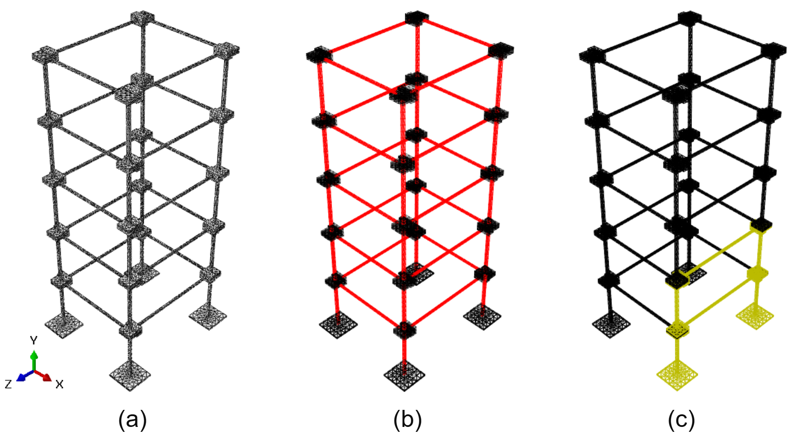
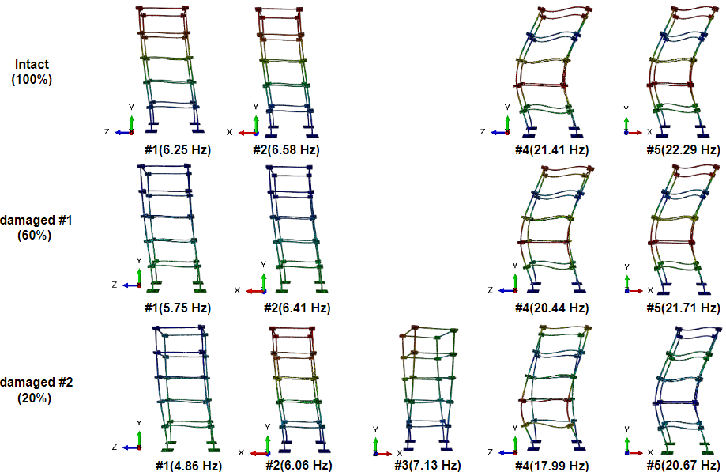
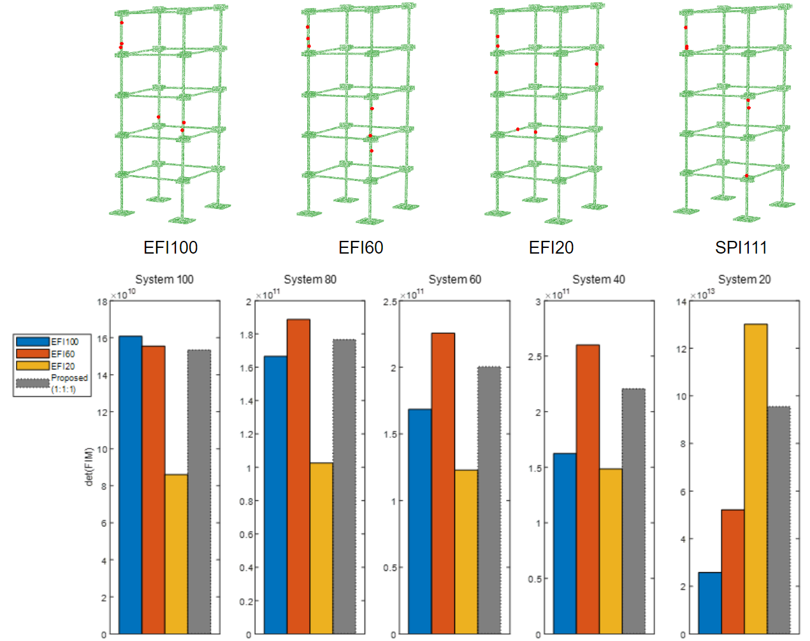

# Sensor Placement Interpolation for Parameter Variation

MATLAB implementation of a Sensor Placement Interpolation (SPI) scheme for robust triaxial accelerometer optimal sensor placement under parametric variation.  
The framework incorporates EFI3+, redundancy filtering, and performance evaluation via det(FIM), MAC, and condition number.

---

## 📌 Related Publication

This repository provides MATLAB codes for the following paper:

**Chanwoo Lee**, Youjin Kim, and Hyung-Jo Jung
*Sensor placement interpolation scheme for modal identification under parametric variation in infrastructure*  
Structure and Infrastructure Engineering (2025)    
DOI: [10.1080/15732479.2025.2579824](https://www.tandfonline.com/doi/full/10.1080/15732479.2025.2579824)

---

## 🎯 Motivation

Optimal sensor placement (OSP) is essential for efficient structural health monitoring (SHM).  
However, conventional deterministic methods often fail to remain optimal when structural parameters vary, such as:

- stiffness degradation (damage scenarios)  
- failure-mode evolution  
- uncertainty in boundary conditions  

This work proposes a Sensor Placement Interpolation (SPI) scheme that provides robust triaxial accelerometer layouts under expected parameter variations.  
The proposed approach combines discrete Effective Independence (EFI)-based sensor placement results across multiple parameter points and interpolates them to achieve a robust Forward Sequential Sensor Placement (FSSP) strategy.

  

---

## ⚙️ Algorithm Overview

The proposed SPI framework extends:

- **EFI3+** (Effective Independence for forward sequential placement of triaxial accelerometers)  
- **Redundancy of Information (RoI)** for eliminating redundant sensor nodes  

together with scenario-weighted interpolation of Fisher Information across parameter variations.

### Workflow

- **Input** → Target modes (Φk), scenario weights (wk), redundancy threshold (Rth), and final sensor number (Nsensor).  
- **1st sensor placement** → Compute and interpolate scenario-dependent importance metrics to select the first optimal node.  
- **Initial placement** → Sequentially add sensors until the reduced FIM (Q0) achieves full rank across all scenarios.  
- **Final placement** → Complete **FSSP** by interpolating EFI3+ scores and removing redundant nodes using RoI filtering.  
- **Output** → Robust triaxial accelerometer layout optimal under expected parametric variations.  

  

---

## 🚀 Running the Code

To reproduce the proposed SPI results and performance evaluation, run the following main scripts:

- `main_SPI.m`  
  → Executes the proposed SPI algorithm and generates robust sensor placement results under parametric variations.

- `main_OSP_evaluation.m`  
  → Evaluates placement performance using det(FIM), MAC-based metrics, and the condition number of the Fisher Information Matrix.

---

## 📌 Case Study: 5-Story Frame Structure

The SPI framework is demonstrated using a high-fidelity 3D FE model of a laboratory-scale 5-story steel frame structure.

  

- (a) FE model of the 5-story frame structure  
- (b) Candidate sensor nodes highlighted in red  
- (c) Parametric variation region highlighted in yellow under stiffness degradation scenarios  

---

### Target Modes Under Damage Scenarios

Target vibration modes are selected under three stiffness conditions:

- Intact case (100%)  
- Damaged case #1 (60%)  
- Damaged case #2 (20%)  

  

- Mode shape evolution and emergence of torsional behavior under parameter variation.

---

### Sensor Placement Results and Performance

SPI is compared with deterministic EFI-based placements (EFI100, EFI60, EFI20).  
The proposed SPI method provides more robust information content across all scenarios.

  

- Sensor placement layouts and det(FIM) performance comparison under multiple parameter cases.
